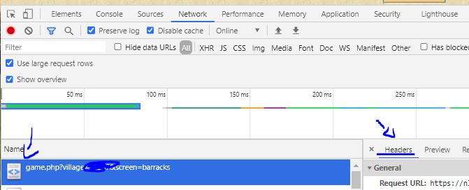

# TWB — Tribal Wars Bot

An open source bot that plays [Tribal Wars](https://www.tribalwars.net/) for you: it builds, recruits, farms, scavenges, trades, researches, defends and nobles — while you keep playing in your browser alongside it.

This is the **LazyTurtle fork** of [stefan2200/TWB](https://github.com/stefan2200/TWB), with a rebuilt web dashboard, multi-world support, scavenging, Telegram notifications, an attack planner and a lot more (see [What this fork adds](#what-this-fork-adds)).

> **Read this first:** using a bot is against the Tribal Wars rules and can get your account banned. The safer you set it up (sane delays, active hours, a real user agent, logging in from your browser now and then) the lower the risk — but the risk never reaches zero. Use it on an account you can afford to lose.

---

## Quick start

Pick the section for your device. All three end in the same place: a dashboard at **http://localhost:5000/** where you add your world and press Start.

You need **Python 3.10 or newer** for the Windows/Linux routes — the installers check for you. The Docker route needs no Python at all.

<details open>
<summary><b>🪟 Windows</b></summary>

1. Download this repository (green **Code** button → **Download ZIP**) and unzip it somewhere permanent, like `C:\TWB`.
2. Double-click **`start.bat`**.

That's it. The first run installs Python's dependencies into a private folder (`.venv\`), checks everything works, then opens the dashboard in your browser.

If Windows says Python is missing, the installer opens the download page for you — during installation **tick "Add Python to PATH"** on the first screen, then double-click `start.bat` again.

</details>

<details open>
<summary><b>🐧 Linux, macOS & Raspberry Pi</b></summary>

```bash
git clone https://github.com/LazyTurtleStyle/TWBOT_LazyTurtle.git
cd TWBOT_LazyTurtle
./install.sh          # one-time: creates .venv/ and installs dependencies
./start.sh            # starts the bot + dashboard
```

`start.sh` puts everything in a [tmux](https://github.com/tmux/tmux/wiki) session so you can watch the panes and detach with `Ctrl-B` then `D` while it keeps running. Re-run `./start.sh` to attach again. No tmux installed? It falls back to running in the background and tells you where the logs are.

On Debian/Ubuntu/Raspberry Pi OS you may need `sudo apt install python3-venv` first — the installer says so if it does.

</details>

<details open>
<summary><b>🐳 Docker (any OS, NAS, VPS)</b></summary>

```bash
git clone https://github.com/LazyTurtleStyle/TWBOT_LazyTurtle.git
cd TWBOT_LazyTurtle
cp .env.example .env      # set your timezone, optional
docker compose up -d
```

Open http://localhost:5000/ and add your world there. One container runs both the dashboard and your bots — the dashboard's Start/Stop buttons control them.

```bash
docker compose logs -f     # watch the bot work
docker compose restart     # after editing a config by hand
docker compose down        # stop
```

Your data lives in `worlds/` on the host, so it survives rebuilds — back that folder up. Once a world runs well, put its name in `.env` as `WORLDS=nl99` so it starts by itself after a reboot.

</details>

---

## First run: getting your world in

The bot plays through **your own browser session**, which is how it gets past the login and captcha. So it needs three things, all entered on the dashboard under **Configure → Settings**:

| Field | Where to get it |
|---|---|
| **World URL** | Log into your world and copy the address bar, e.g. `https://nl99.tribalwars.nl/game.php?village=12345&screen=overview` |
| **User agent** | Google "what is my user agent" and paste the result. Matching your real browser lowers detection. |
| **Cookie string** | See below |

**Finding the cookie string (Chrome/Edge/Firefox):** press `F12` → **Network** tab → refresh the page → click the first `game.php` request → scroll to **Request Headers** → copy the whole value of the `cookie:` header.



Paste all three into the dashboard, press create, and the bot starts playing. Your villages get added automatically as you conquer them.

> **Keep the session alive:** log out and back in through your browser once or twice a day and paste the fresh cookie string into the dashboard. A single session running for 24h straight is a strong ban signal. If a captcha appears, just solve it in your browser on the same session — the bot notices and resumes on its own.

---

## Using it from your phone or another PC

The dashboard is a normal web page, so anything with a browser can drive it.

1. Find the IP of the machine running the bot (`ip a` on Linux, `ipconfig` on Windows) — something like `192.168.1.42`.
2. On your phone, open `http://192.168.1.42:5000/`.

`start.sh`, `start.bat` and Docker all bind the dashboard to your whole network already. To restrict it to the local machine instead, run `HOST=127.0.0.1 ./start.sh`.

> **Never port-forward the dashboard to the internet.** It has no login — anyone who finds it controls your account. To reach it from outside your home, use a VPN like [Tailscale](https://tailscale.com/) or WireGuard.

**Bonus — jump straight into the game:** the `browser-extension/` folder holds a small Chrome/Edge extension that restores your Tribal Wars session in one click, so you can open the game in your browser without invalidating the bot's session after a reboot. Download it from the dashboard at **http://localhost:5000/app/tw-open** (it comes pre-configured for your server and world), then in Chrome/Edge go to `chrome://extensions`, enable **Developer mode**, and use **Load unpacked**.

---

## Running more than one world

One copy of the bot plays several worlds at once, each with its own config, session and cache, all from a single dashboard:

```bash
./start.sh nl99 nl98        # two worlds, one shared dashboard
```

Each world keeps its data in `worlds/<name>/` (`config.json` + `cache/`). Templates are shared. A **World** dropdown appears in the dashboard navbar to switch between them; Start/Stop and status target the selected world.

On Docker, set `WORLDS=nl99 nl98` in `.env`. On Windows, `start.bat nl99`.

Running plain `./start.sh` with no world name uses the project root as before, so existing single-world setups keep working unchanged.

---

## Keeping it running 24/7

| Setup | How |
|---|---|
| **Docker** | Already handled — `restart: unless-stopped` brings it back after a crash or reboot. |
| **Raspberry Pi / VPS / home server** | `sudo cp deploy/twb.service /etc/systemd/system/` — edit the user and paths inside, then `sudo systemctl enable --now twb`. Watch it with `journalctl -u twb -f`. |
| **Windows PC** | Leave the `start.bat` window open. For always-on use, a Pi or a cheap VPS is far kinder to your electricity bill. |

---

## What this fork adds

On top of upstream's building/recruiting/research/market/farming/snob automation:

**Dashboard**
- Rebuilt "war-room" interface: village overview with live resources, troops and build queues, per-village detail pages, config editor with search, and a first-run setup page
- Multi-world switcher, Start/Stop per world, live bot log, and a silent-stall detector that tells you when the bot has quietly stopped doing anything
- Farm and scavenge status per village at a glance

**Farming & scavenging**
- Farm Assistant integration and a built-in combat simulator
- Full scavenging support: auto-unlock, per-group policies, troop picker, night consolidation (runs sized so they return before the window closes), and pausing while under attack
- Per-village toggles for farming, building and recruiting

**Attacking & defence**
- Attack planner with timed auto-send, inline target ETAs and map deep links
- Incoming attack tracking with in-game tagging
- Defence: automatic support, unit evacuation, and support-sniping
- Cancel-sniping *(alpha)* and an automated barbarian "shaper" that razes walls with axe+ram *(alpha)*

**Reliability & quality of life**
- Telegram notifications with per-category toggles (crashes, captcha, sessions, farming, attacks…)
- Captcha auto-resume — solve it in your browser and the bot picks up where it left off, no restart
- Session-restore browser extension, socket timeouts, world-aware re-auth, crash recovery
- Daily login bonus claiming, premium point trading, per-1000 market trades

Features marked *(alpha)* work but are less tested — turn them on knowing that.

---

## Updating

```bash
git pull                       # Linux/macOS/Pi + Docker
./install.sh                   # refresh dependencies
docker compose up -d --build   # Docker only, instead of install.sh
```

On Windows: download the new ZIP, copy your `config.json`, `worlds/` and `cache/` folders across, then run `setup.bat` once.

---

## Troubleshooting

| Symptom | Fix |
|---|---|
| **"Bot protection" / captcha in the log** | Solve the captcha in your browser on the same session. The bot polls and resumes automatically. |
| **Bot runs but nothing happens** | Check the dashboard's stall banner. Usually a dead session — paste a fresh cookie string. Also check your in-game report filters aren't filing reports into groups the bot never reads. |
| **"Not enough resources" spam** | Normal. The bot retries as resources come in. |
| **Dashboard unreachable from your phone** | Check the firewall on the host, and that you used the machine's LAN IP rather than `localhost`. |
| **Windows: `python` is not recognised** | Reinstall Python with **Add Python to PATH** ticked, then run `setup.bat`. |
| **Everything is broken after an update** | Run `./install.sh` (or `setup.bat`) to refresh dependencies. |

Still stuck? Open an issue at [TWBOT_LazyTurtle/issues](https://github.com/LazyTurtleStyle/TWBOT_LazyTurtle/issues), or ask in the upstream project's [Discord](https://discord.gg/8PuzHjttMy).

---

## More documentation

- [readme/readme.md](readme/readme.md) — how the bot plays a world from day one to nobling
- [readme/configs.md](readme/configs.md) and [ConfigReadme.md](ConfigReadme.md) — every config option explained
- [readme/farm_checklist.md](readme/farm_checklist.md) — **run through this before turning farming on**; it's easy to miss a setting that leaves farming silently disabled
- [CHANGELOG.md](CHANGELOG.md) — what changed between versions

---

## Credits & licence

Built on [stefan2200/TWB](https://github.com/stefan2200/TWB) — all credit for the original bot goes there. This fork adds the dashboard, multi-world support and the features listed above.

Licensed under the GPL — see [LICENSE.md](LICENSE.md).
