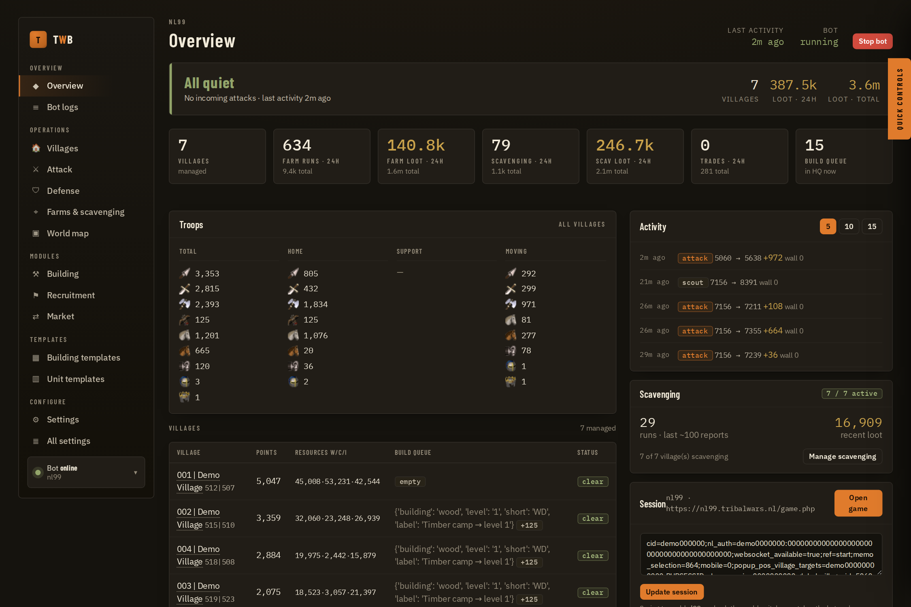
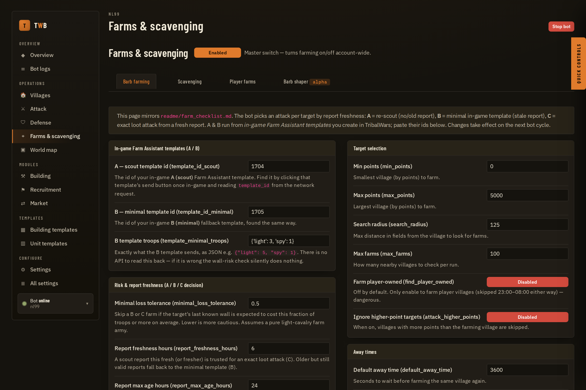
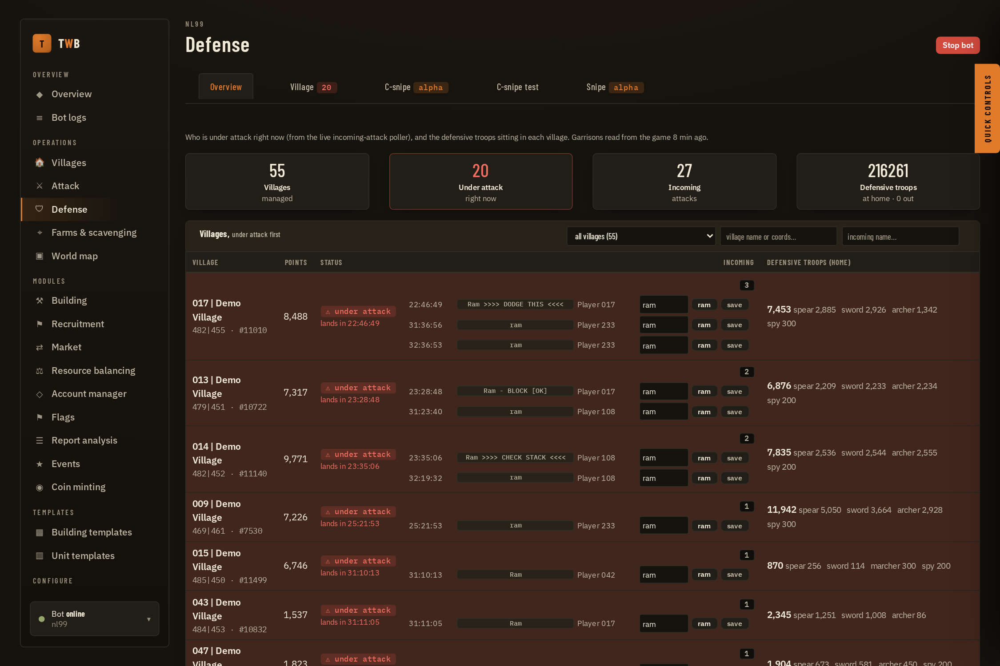
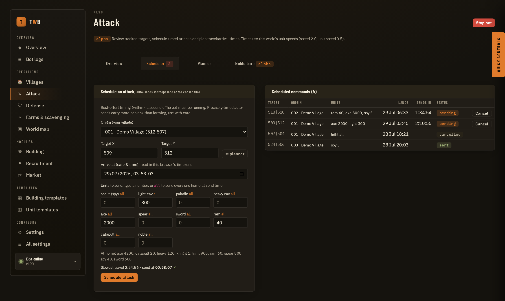
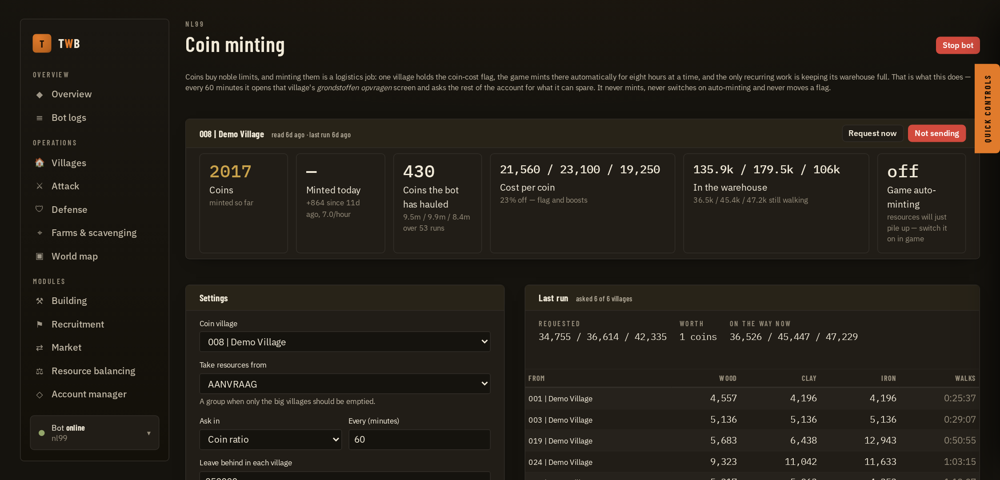
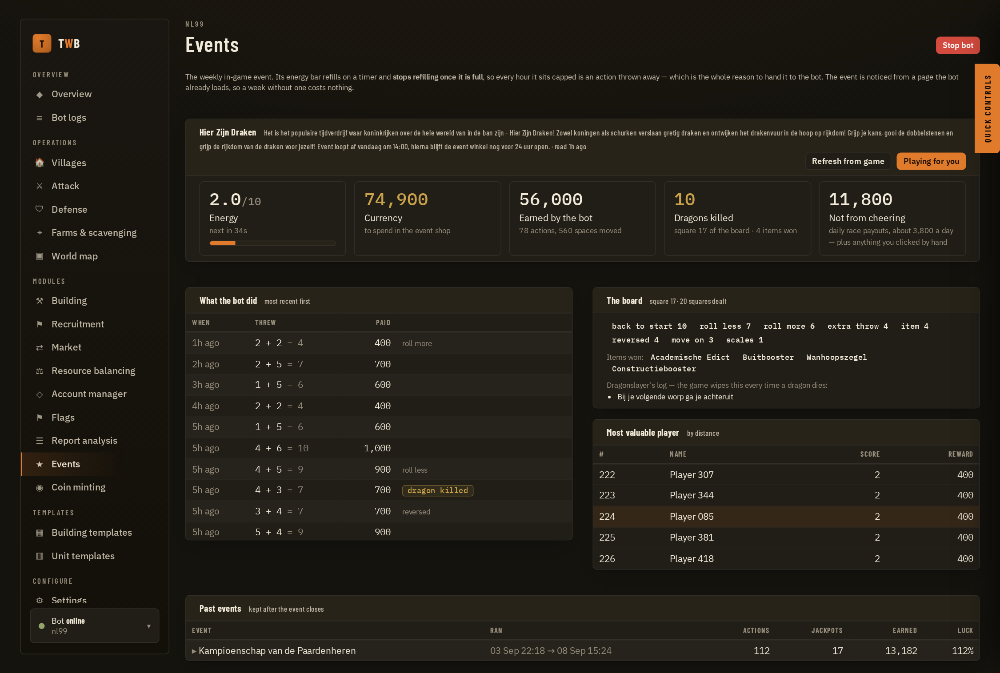
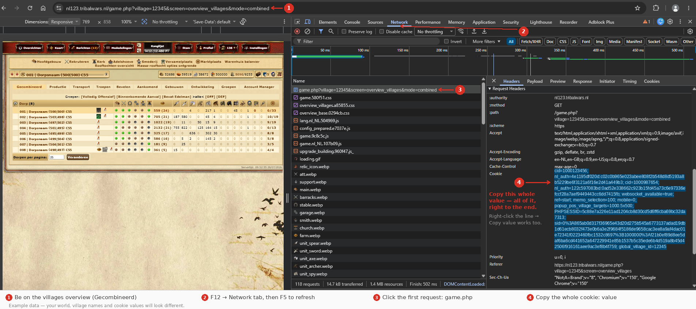
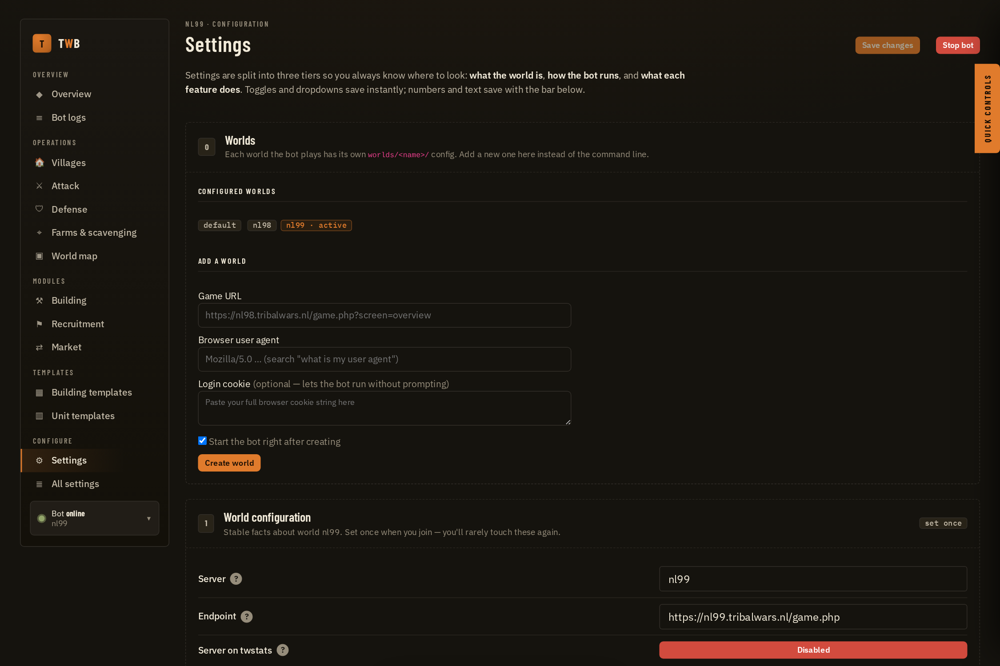
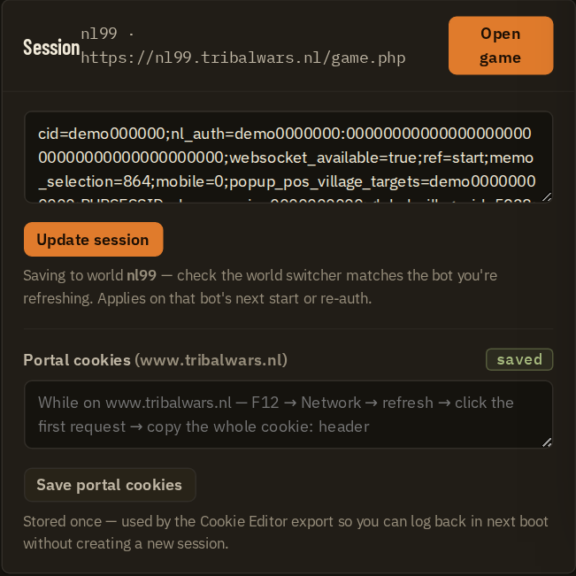
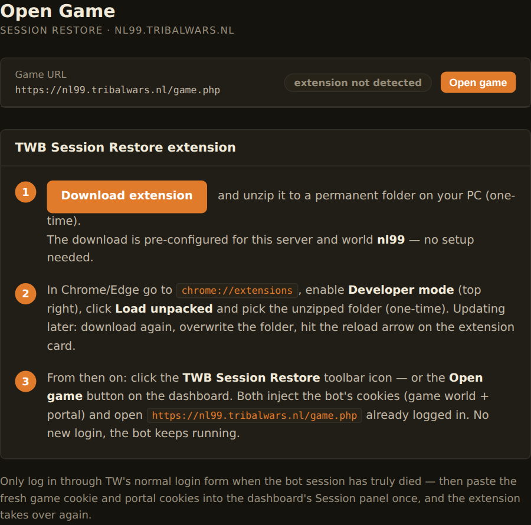

# TWB: Tribal Wars Bot

An open source bot that plays [Tribal Wars](https://www.tribalwars.net/) for you: it builds, recruits, farms, scavenges, trades, researches, defends and nobles, while you keep playing in your browser alongside it.

This is the **LazyTurtle fork** of [stefan2200/TWB](https://github.com/stefan2200/TWB), the original bot, heavily extended through vibe coding: a rebuilt web dashboard, multi-world support, scavenging, an attack planner, Telegram alerts and a long list of smaller fixes. See [What's new in this fork](#whats-new-in-this-fork).



*The dashboard: every village at a glance, live troop counts, what the bot just did, and whether anything is heading your way.*

### A note on servers

This is played and tested almost entirely on **Dutch (`.nl`) worlds**. Nothing is deliberately NL-only (world settings are read from the server, and market-specific details like the account portal domain are worked out from your world's own address), but the `.net`, `.de` and other markets have had far less real play behind them, and the odd thing may well be broken there. If you hit something market-specific, [open an issue](https://github.com/LazyTurtleStyle/TWBOT_LazyTurtle/issues) and say which server you're on.

### About bans

The bot doesn't log in for you. It rides on **your own browser session**, you paste in your cookies, and you solve any captcha yourself, in your own browser. That's the main reason it stays quiet: to the server, the traffic comes from a session a human opened and a human unblocks.

Running it this way, I have **not seen a ban yet**.

That is not a promise. Botting is against the Tribal Wars rules, detection changes over time, and a careless config (hammering the server, running 24/7 with no active hours, a fake user agent) will get you noticed. **Don't use an account you're not willing to lose.**

---

## What's new in this fork

On top of upstream's building, recruiting, research, market, farming and noble automation:

**A real dashboard**
- Rebuilt "war-room" web interface: village overview with live resources, troops and build queues, per-village detail pages, and a config editor with search
- Start and stop your bot from the browser, watch the live log, and get warned by a silent-stall detector when the bot has quietly stopped doing anything
- Farm and scavenge status per village at a glance
- A draggable, zoomable **world map** coloured the way you already coloured it in-game (your tribe and player markings), with your own villages ringed
- Filter the village override table by in-game group, and set a whole column at once for just the villages on screen

**Multi-world**
- One installation plays several worlds at once, each with its own config, session and cache, all from a single dashboard with a world switcher

**Farming & scavenging**
- Farm Assistant integration and a built-in combat simulator
- Full scavenging support: auto-unlock, per-group policies, a troop picker, night consolidation (runs sized to return before the window closes) and pausing while under attack
- Per-village toggles for farming, building and recruiting



*Every farming knob in one place, each with a plain-English explanation of what it does.*

**Attacking & defence**
- Attack planner with timed auto-send, inline target ETAs and map deep links, aimed on the game's own clock to the millisecond
- Fake trains: send one row as several back-to-back commands, and warn when a command is too small for the game to accept
- A queue view built for hundreds of commands: edit a queued arrival or its troops in place, and cancel every ticked command at once
- Noble jobs added by pasting a list of coordinates; noble trains fold into one row
- Automatic defensive support, unit evacuation and a barbarian "shaper" that razes walls with axe+ram *(alpha)*



*Every village under attack on top, each incoming command on its own line with the name the game shows, who sent it, and the defence sitting at home.*

**Defense**
- Incomings ordered by the millisecond they land, filterable by village and by the command name the game shows
- Tag incomings straight from the dashboard, one at a time or for the whole account from the Overview, with the unit the flight time implies already filled in
- A **Village** tab for one village's incoming attacks and support side by side
- **Snipe** *(alpha)*: a launch list in the style of the well-known snipe calculators. Arm several options at once; the bot sends support as support, checks the game actually accepted it, and recalls anything that would land outside the window you set
- **Cancel-sniping** *(alpha)*: dodge as support to your own village, with the cancel fired inside the right wall-clock second
- Villages nothing can reach in time are folded away, and snipes can be filled from a troop template

**Report analysis** *(alpha)*
- Reads your battle reports back and finds the **dead clears**: nukes that died on your walls, counted by who sent them. A dead nuke takes weeks to rebuild
- Writes the answer onto the attacker's village as the game's own private village note (OFF/DEF, with the date), so it's right there when the next incoming shows up, not in a spreadsheet
- Also notes the clears that are still alive. Runs when you press the button, not every cycle



*Pick an origin, a target and the moment you want troops to land. The bot works out the send time from the slowest unit and fires it for you.*

**Premium Account Manager**
- Hand building, recruiting and research to the in-game Account Manager, and the bot stops doing them (and stops reading the screens it only needed for them)
- Keep a group &rarr; sjabloon plan on the Account manager page and have it re-applied every morning, because the manager's build queue runs dry after a few days

**Economy**
- **Resource balancing**: your big villages feed your small ones through the in-game send screen. How much goes out depends on how full the receiver is, and shipments already on the road count as delivered, so three senders never fill the same empty warehouse
- **Coin minting**: keeps the warehouse of your coin village full by asking the rest of the account for what it can spare, on a timer (every 60 minutes by default). It never mints, never switches auto-minting on and never moves a flag. Shows coins minted, what the bot hauled and the cost per coin
- **Flags** *(alpha)*: flags are one pool for the whole account, not a per-village setting, so you set a group &rarr; flag type plan and the bot applies it in a single pass. Later rows win, the most specific row gets served first when there aren't enough flags, and anything short is listed as unmet



*The coin village's stock, what each sender was asked for on the last run, and how long the merchants take to walk it over.*

**Events**
- The weekly in-game event is noticed automatically from a page the bot already loads, and can be played for you: its energy bar refills on a timer and stops once full, so every hour it sits capped is an action lost
- Picks the choice with the best expected value *at that moment* rather than a fixed one, because the jackpots are progressive and the best option moves with them
- Tracks every action, what it paid, and how the luck ran against what the choices were worth; finished events stay on file as history
- Plays board events too (the dragons board: rolls, squares and items won), and counts the daily race payouts on top of what the bot earned itself



*A live event: energy and when it refills, what each throw paid, the board, the leaderboard, and past events kept on file.*

**Staying alive**
- Telegram notifications with per-category toggles (crashes, captcha, sessions, farming, attacks…)
- Captcha auto-resume: solve it in your browser and the bot picks up where it left off, no restart
- A browser extension that restores your game session in one click, so opening the game yourself doesn't kill the bot's session (Chrome, Edge and Firefox)
- Socket timeouts, world-aware re-auth, crash recovery, daily login bonus claiming, premium point trading
- A dead session puts the bot to sleep instead of crashing it, and it stays quiet during your inactive hours, captcha checks included

Anything marked *(alpha)* works but is less tested. Switch it on knowing that.

---

## Setting it up

Two steps on any machine: **install it**, then **give it your world and cookies**. Install instructions per platform are below; everything after that is the same everywhere.

You'll want **Python 3.10 or newer**. The installers check, and tell you if it's missing.

### 🪟 Windows

1. Download this repository: green **Code** button → **Download ZIP**.
2. Unzip it somewhere permanent, like `C:\TWB` (not your Downloads folder).
3. Double-click **`start.bat`**.

That's the whole install. The first run sets up the dependencies in a private `.venv\` folder, checks everything imports, then opens the dashboard at **http://localhost:5000/** in your browser.

If Windows says Python is missing, the installer opens the download page for you. During that install, **tick "Add Python to PATH"** on the first screen. It's easy to miss, and nothing works without it. Then double-click `start.bat` again.

To stop the bot, close the console window. To start it again, double-click `start.bat`.

### 🐧 Linux, macOS & Raspberry Pi

```bash
git clone https://github.com/LazyTurtleStyle/TWBOT_LazyTurtle.git
cd TWBOT_LazyTurtle
./install.sh          # one-time: creates .venv/ and installs dependencies
./start.sh            # starts the bot + dashboard
```

The dashboard is then at **http://localhost:5000/**.

`start.sh` runs everything in a [tmux](https://github.com/tmux/tmux/wiki) session, so you can watch the panes and detach with `Ctrl-B` then `D` while it keeps running. Run `./start.sh` again to reattach. If tmux isn't installed it runs in the background instead, and prints where the logs are.

On Debian, Ubuntu and Raspberry Pi OS you may need `sudo apt install python3-venv` first. `install.sh` says so if you do.

### 🐳 Docker (optional, for a NAS or VPS)

```bash
git clone https://github.com/LazyTurtleStyle/TWBOT_LazyTurtle.git
cd TWBOT_LazyTurtle
cp .env.example .env      # set your timezone
docker compose up -d
```

One container runs the dashboard and your bots together. `docker compose logs -f` to watch it, `docker compose down` to stop. Your data stays on the host in `worlds/`.

---

## Getting your cookies

The bot needs your browser's session to act as you. This is the one manual step, and you'll repeat it every day or two as the session expires.

**In Chrome or Edge:**

1. Log into your Tribal Wars world as normal.
2. Go to the **villages overview**, the *Overzicht* screen, on **Gecombineerd** (combined) if your world offers it. This is the page the bot itself works from, so it's the one to copy the session from.
3. Press `F12` to open developer tools, and click the **Network** tab.
4. Press `F5` to refresh the page.
5. Click the first request in the list. It's called **`game.php`**.
6. Scroll down to **Request Headers** and find the line starting with `cookie:`.
7. Copy the **entire value** after `cookie:`, a long string of `name=value;` pairs, right to the end. Right-clicking the line and choosing **Copy value** does the same thing.



**In Firefox:** the same steps, `F12` → **Network** → refresh → click `game.php` → **Headers** → **Request Headers** → copy the `Cookie` value.

**Where to paste it:** the dashboard, **http://localhost:5000/**, the **Session** box on the Overview page, then **Update session**. That's the only place. Never paste a cookie into the bot's console window: a terminal cuts long lines short, and a cookie string is long, so what you get is a session that looks accepted but comes back logged out on every cycle. The bot no longer asks for one there: if it has no session it prints where to paste and waits, then starts by itself within seconds of your paste.

> **Keep the session healthy.** Log out and back in through your browser once or twice a day, and paste the fresh cookie string into the dashboard. One session running 24 hours straight is a strong bot signal.
>
> **If a captcha appears,** solve it in your browser on that same session. The bot notices it clear and resumes on its own, no restart needed.

---

## Setting up your world

With the bot running, open **http://localhost:5000/** and go to **Configure → Settings** in the left sidebar.



### 1. Add your world

Under **Add a world**, fill in three fields:

| Field | What to put in it |
|---|---|
| **Game URL** | The address bar of your logged-in world, e.g. `https://nl99.tribalwars.nl/game.php?village=12345&screen=overview` |
| **Browser user agent** | Google "what is my user agent" and paste the result. Matching your real browser lowers detection. |
| **Login cookie** | The long string you just copied. Marked optional in the UI, but fill it in: the bot cannot play without a session, and this is the only place to give it one. |

Press create. The bot works out the world name from the URL, writes its config and starts playing. Your villages are added automatically as you conquer them.

On a brand-new copy the bot has nothing to run yet, so it prints *"No world set up yet"* and waits for exactly this form. The moment you press create, it picks the world up and starts. No restart, and nothing to type in the console. (If you'd rather answer the questions in a terminal, `python twb.py --setup` still runs the old wizard; it can't take the cookie, though, so you'll come back here for that.)

### 2. Go through the settings

Still under **Configure**: **Settings** holds the things you set once, and **All settings** exposes everything with a search box. Worth a look before you leave it running:

- **Bot**: `active_hours` (e.g. `6-23`, so it sleeps at night like a human) and `delay_factor`. These two matter most for staying unnoticed.
- **Building** and **Recruitment**, which template the bot builds and recruits towards. Templates live under **Templates** in the sidebar if you want to shape your own.
- **Farms**: ⚠️ **read [readme/farm_checklist.md](readme/farm_checklist.md) before switching farming on.** It's easy to miss a setting that leaves farming silently disabled, or pointed at the wrong villages.
- **Market**: resource balancing and premium point trading.
- **Notifications (Telegram)**: optional, but worth it. The page walks you through @BotFather and has a "send test message" button.
- **Default village template**: the settings each newly conquered village inherits.

Config changes are picked up while the bot runs; no restart needed.

### 3. Watch it play

The sidebar is grouped by what you're doing:

- **Overview**: what every village is doing right now, recent loot, last activity. **Bot logs** shows the live log.
- **Operations**: **Villages** (per-village detail and toggles), **Attack** (planner and timed sends), **Defense** (incomings, tagging and snipes), **Farms & scavenging**, **World map**.
- **Modules**: building, recruitment and market config, plus **Resource balancing**, **Account manager**, **Flags**, **Report analysis**, **Events** and **Coin minting**.

If something looks stuck, the Overview banner tells you whether it's a captcha, a dead session, or a genuine stall.

---

## Opening the game yourself, without killing the bot

Sooner or later you'll want to play in your own browser, after a reboot, or just to look around. There's a trap here worth understanding before you hit it.

Tribal Wars keeps you logged in with cookies on **two** domains:

| Domain | Holds | Who has it |
|---|---|---|
| `<your world>.tribalwars.nl` | the world session (`sid`, `cid`, …) | the bot |
| `www.tribalwars.nl`, the account portal | the login (`PHPSESSID`, `nl_auth`, …) | your browser only |

(Swap in your own market: `.net`, `.de`, `.co.uk`. The dashboard works out the portal domain from your world's address and shows it on the Session panel.)

The bot only holds the world cookies. So if you log in through the portal and click into your world the normal way, **Tribal Wars mints a brand new world session and the bot's session dies**. You come back to a stalled bot and have to paste a fresh cookie string.

The session-restore extension avoids that: it injects the bot's own cookies into your browser and opens the world directly, so you and the bot share one session. Three one-time steps.

### Step 1: Save your portal cookies

The bot can't read these itself (they're on a domain it never visits), so you hand them over once.

1. Open **www.tribalwars.nl** in your browser and make sure you're logged in.
2. Press `F12` → **Network** tab → `F5` to refresh.
3. Click the **first** request in the list.
4. Under **Request Headers**, copy the whole value of the `cookie:` line.
5. In the dashboard's **Overview**, find the **Session** panel on the right, paste it into **Portal cookies**, and press **Save portal cookies**. The badge flips to `saved`.



*Same panel holds both: the top box is your world session, the bottom one your portal cookies.*

### Step 2: Install the extension

1. Open **http://localhost:5000/app/tw-open** and click **Download extension**. Unzip it to a folder you won't delete.
2. In Chrome or Edge, go to `chrome://extensions`, turn on **Developer mode** (top right), click **Load unpacked**, and pick that folder.

**On Firefox,** click **Download for Firefox** instead, then go to `about:debugging#/runtime/this-firefox` → **Load Temporary Add-on** and pick the `manifest.json` in the folder. Firefox forgets a temporary add-on every time it restarts, which is exactly when you need it after a reboot. To make it stay, upload the zip to [addons.mozilla.org](https://addons.mozilla.org/developers/addon/submit/distribution) as an **unlisted** add-on (free, not published) and install the signed `.xpi` Mozilla hands back. The Open Game page explains the other options.



The download is already configured for your server and world. There's nothing to fill in. The pill on that page flips to **extension installed ✓** once Chrome has it.

### Step 3: Use it

Click the **TWB Session Restore** toolbar icon, or the **Open game** button on the dashboard. Either one injects both sets of cookies and opens your world already logged in, with the bot still running.

**When you need to redo it:**

- **After logging into the portal through TW's normal login form**: that invalidates your stored portal cookies, so re-save them (step 1). Logging into the *portal* alone doesn't kill the bot's world session; only entering a world through it does.
- **If the bot's session truly dies**: paste a fresh cookie string into the **Session** box, and the extension works off that again.

---

## Using it from your phone

The dashboard is a normal web page, so anything with a browser can drive it, **as long as it's on the same WiFi as the machine running the bot.**

1. Find the IP of the machine running the bot (`ip a` on Linux, `ipconfig` on Windows), a private address that looks like `192.168.1.42`. Yours will be a different number.
2. On your phone, connected to your home WiFi, open `http://192.168.1.42:5000/`, your own address, same port.

That address is a private one: it only exists inside your own network. On mobile data, or anywhere away from home, your phone has no route to it and the page will simply time out. **To reach it from outside, use a VPN like [Tailscale](https://tailscale.com/) or WireGuard**. Your phone then joins your home network from anywhere, and the same address works.

**Changing the address or port.** By default the dashboard listens on every interface of the machine (`0.0.0.0`) at port `5000`. That's what makes it reachable from your phone in the first place. `http://localhost:5000/` keeps working on the machine itself no matter what you pick.

- **Linux / macOS**: `start.sh` reads two environment variables: `PORT=5001 ./start.sh` moves it to another port, `HOST=127.0.0.1 ./start.sh` locks it to the bot's own machine, and `HOST=192.168.1.42 ./start.sh` binds one specific interface.
- **Windows**: edit the `set "PORT=5000"` line near the top of `start.bat`.
- **Docker**: set `PORT` in your `.env`; that's the port on the host side. To pin it to one address as well, change the mapping in `docker-compose.yml` to `"192.168.1.42:5000:5000"`.

> **Never port-forward the dashboard to the internet** to get around this. It has no login of any kind: anyone who finds the open port controls your bot and your account.

**Jumping into the game yourself:** see [Opening the game yourself, without killing the bot](#opening-the-game-yourself-without-killing-the-bot).

---

## Playing more than one world

One copy of the bot plays several worlds at once, each with its own config, session and cache:

```bash
./start.sh nl99 nl98          # Linux/macOS/Pi
start.bat nl99                # Windows
```

Each world keeps its data in `worlds/<name>/`; templates are shared. A **World** dropdown appears in the dashboard navbar to switch between them, and start/stop targets the selected world. On Docker, set `WORLDS=nl99 nl98` in `.env`.

Running plain `./start.sh` (or double-clicking `start.bat`) with no world name uses the project root, so single-world setups keep working unchanged. If there is no `config.json` in the project root and exactly one world under `worlds/` is set up, that world is started instead, so double-clicking cannot walk you into setting the same account up a second time. With several worlds set up, it asks you to name one.

Different worlds run side by side, but the **same account never runs twice**: a second bot on one account makes the two fight over the game session until one is permanently logged out. Starting one anyway just prints which process already has that account and exits.

---

## Keeping it running 24/7

| Setup | How |
|---|---|
| **Docker** | Already handled: it restarts after a crash or reboot. |
| **Raspberry Pi / VPS** | `sudo cp deploy/twb.service /etc/systemd/system/`, edit the user and paths inside, then `sudo systemctl enable --now twb`. Watch it with `journalctl -u twb -f`. |
| **Windows PC** | Leave the `start.bat` window open. For always-on play, a Pi or cheap VPS is far kinder to your power bill. |

---

## Updating

```bash
git pull && ./install.sh          # Linux/macOS/Pi
docker compose up -d --build      # Docker
```

On Windows: download the new ZIP, copy your `worlds/` folder across (and `config.json`, if you run a single world), then run `setup.bat` once.

---

## Troubleshooting

| Symptom | Fix |
|---|---|
| **"Bot protection" / captcha in the log** | Solve the captcha in your browser on the same session. The bot resumes by itself. |
| **Bot runs but nothing happens** | Usually a dead session: paste a fresh cookie string **in the dashboard**, never in the console. Also check your in-game report filters aren't filing reports into groups the bot never reads. |
| **`session looks logged out (cookie expired)` every cycle, but the game and the dashboard log look fine** | A second bot was started on the same account and the two logged each other out. Close the extra one: one bot per account. Newer versions refuse to start the second one and tell you which process already holds the account. |
| **"Not enough resources" in the log** | Normal. The bot retries as resources come in. |
| **Farming does nothing** | Work through [readme/farm_checklist.md](readme/farm_checklist.md). |
| **Dashboard unreachable from your phone** | Check the host's firewall, and that you used its LAN IP rather than `localhost`. |
| **Windows: `python` is not recognised** | Reinstall Python with **Add Python to PATH** ticked, then run `setup.bat`. |
| **Broken after an update** | Run `./install.sh` (or `setup.bat`) to refresh dependencies. |

Still stuck? Open an issue at [TWBOT_LazyTurtle/issues](https://github.com/LazyTurtleStyle/TWBOT_LazyTurtle/issues), or ask in the upstream project's [Discord](https://discord.gg/8PuzHjttMy).

---

## More documentation

- [readme/readme.md](readme/readme.md): how the bot plays a world, from your first buildings to nobling
- [readme/configs.md](readme/configs.md) and [ConfigReadme.md](ConfigReadme.md): every config option explained
- [readme/farm_checklist.md](readme/farm_checklist.md): run through this before turning farming on
- [CHANGELOG.md](CHANGELOG.md): what changed between versions

---

## Credits & licence

Built on [stefan2200/TWB](https://github.com/stefan2200/TWB). All credit for the original bot goes there. This fork adds the dashboard, multi-world support and everything under [What's new](#whats-new-in-this-fork).

Licensed under the GPL. See [LICENSE.md](LICENSE.md).
